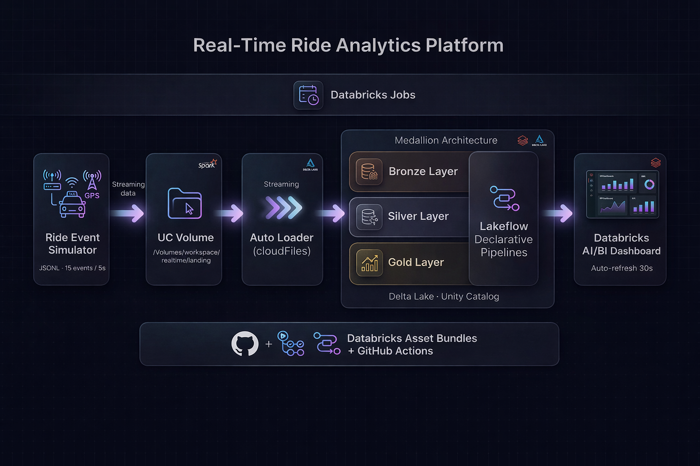

## End-to-End Real Time Mobility Analytics Platform Medallion Architecture 
Simulates a high-throughput ride-booking system to ingest, process, and analyze streaming ride events in real time using Spark Structured Streaming and Databricks Lakehouse architecture. Implements a Medallion (Bronze–Silver–Gold) pipeline with Lakeflow and Auto Loader to deliver low-latency, analytics-ready insights via AI/BI dashboards.

### Project Architecture

🔗 **[Open Dashboard](https://dbc-221765d5-da63.cloud.databricks.com/dashboardsv3/01f12e773550167d9ecf5317e82b4ef1/published?o=7474652470309332)**
